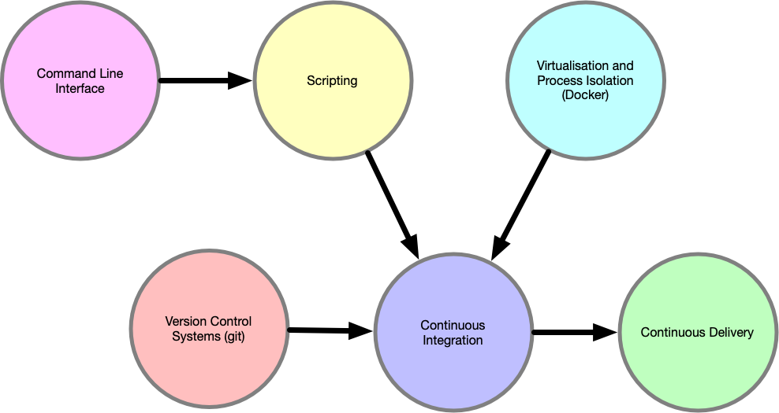

# Lecture 1a: Introduction

This lecture will cover:

- Meet & Greet
- About The Course
- Forming Groups
- Installing a Virtual Private Server (VPS)
- Vim-tutor

## Meet & Greet

I am Henrik Strøm:

- Adjunct lecturer at KEA
- PhD Fellow at Aalborg University in Copenhagen
- M.Sc. in Engineering (Civilingeniør, cand. polyt.)
- Master in Information and Communication Technologies (mICT)
- Worked 25+ years in IT: helpdesk, operations, design, governance, management, development
- UNIX-gray-beard-kind-of-guy

{ width=75% }

:material-account-question: Quick introduction: what's your name, what are your expectations for this course?

## About The Course

The overall theme for this course is **quality assurance**.

{ width=70% }

This course is about all the things that goes into the project, except the primary code base.

This course will turn you into a much better developer.

## Forming Groups

!!! warning inline end "Very Important!"

    Please organize groups before leaving class today!

Because we are dealing with *collaboration tools* in this course, you are required to work in groups of **3 or 4 students**.

It will be a great advantage to you if you form groups so that you share a course where you will develop a large software project, e.g., **DevOps with Linux, Python & Django**.

You will find a `Groups-sheet` on Teams in the `Files` section.
List your **full names** on the group you are part of.
