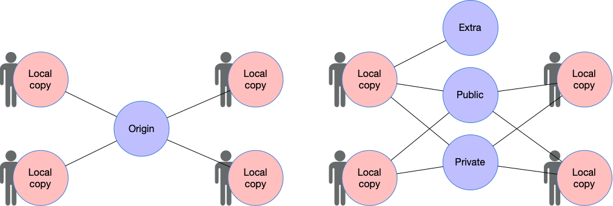
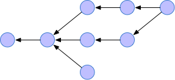
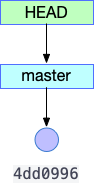
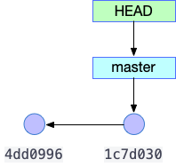
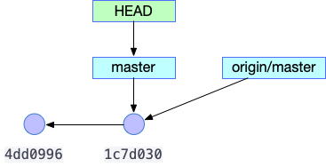
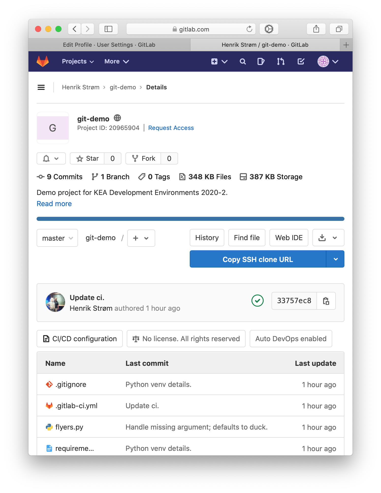
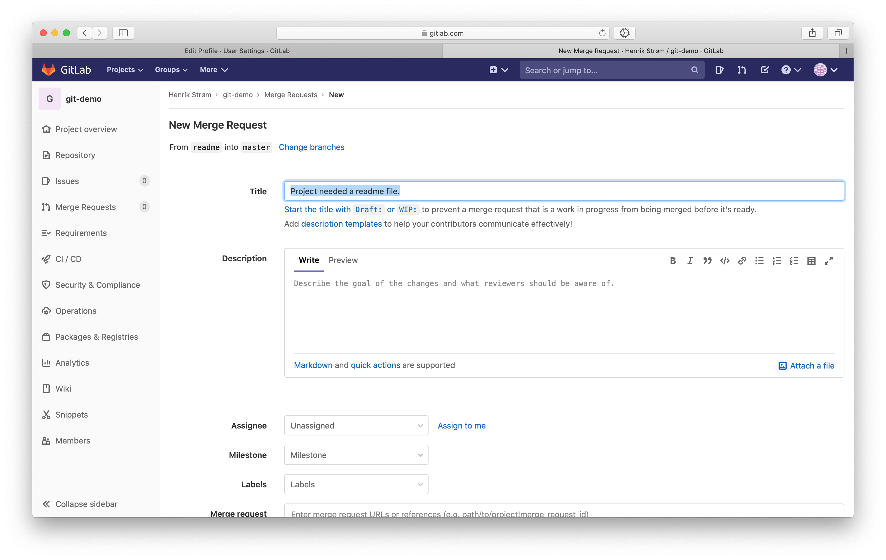
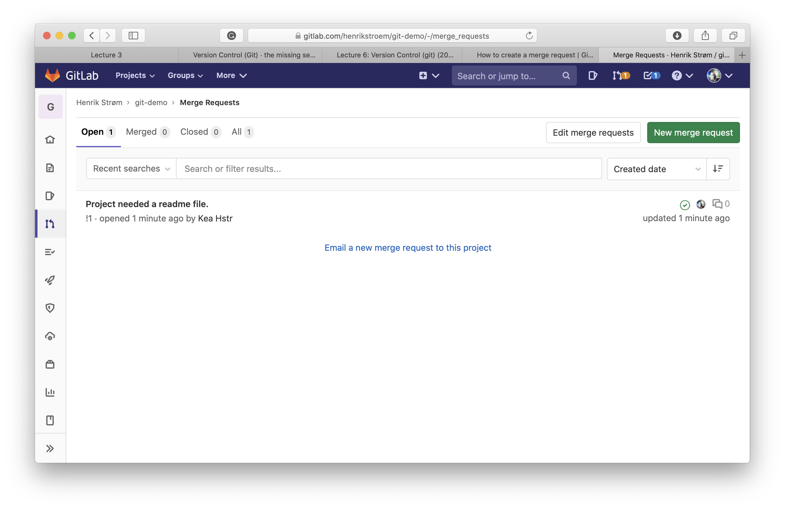
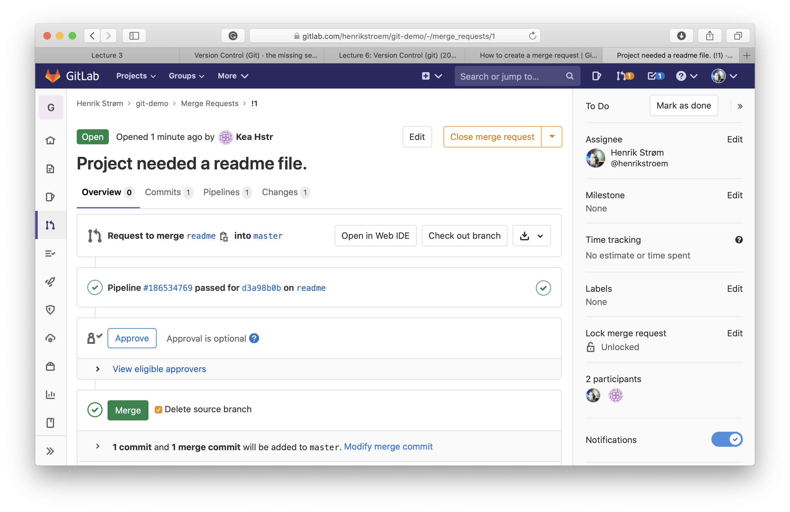
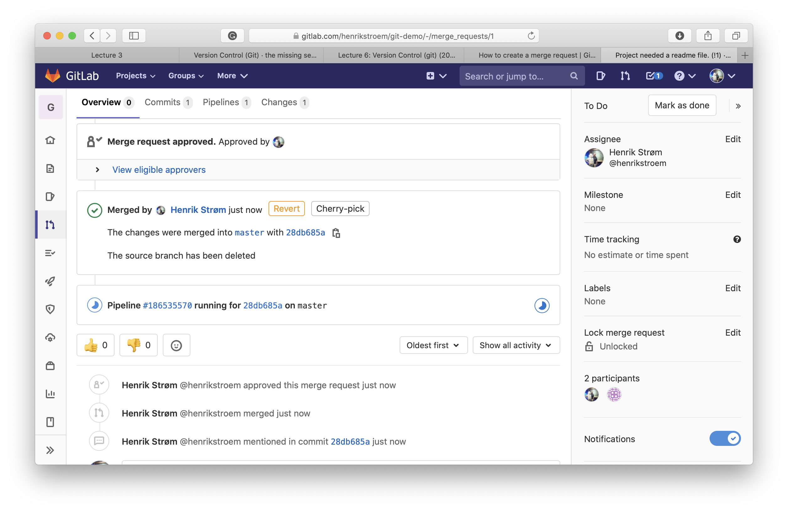

# Lecture 4: Version Control Systems


## What are Version Control Systems

Version Control Systems (also called  source control systems) are tools used to track changes to a set of files and folders, usually source code, and allow for teams of contributors to work together on projects.

Using a version control system has many advantages:

- it allows us to revert to a previous state of our project
- it allows us to actively work on multiple branches of our project simultaneously
- it allows for branches to be integrated with each other
- it allows for control of who can approve of integrations
- it allows us to see who made changes (who to blame)
- associate meta data such as time stamp, author, a note etc., with changes

Modern software development is deeply dependent on version control systems, but it is possible to apply the technology in many more places.

Today, **git** has become the de facto standard of version control systems, so it is the one we will focus on in this course.


## Git - A Distributed Version Control System

Git is a *distributed* version control system.

In traditional version control systems developers would *check out* files from a repository, and thus prevent other developers from changing the file until the developer would *check in* the file with whatever changes he would make.

Git, with its distributed design, allows multiple developers to work simultaneously on the same file.
This introduces the risk of *conflicts* if several developers make changes to the same pieces of code, and later in this lecture we will look at this problem.

Exchange of data between multiple developers happens via *remotes*.
These are special *bare* repositories that users can push and pull data from, but not commit to directly.
A developer can use multiple remotes for a project, see examples in figure 4.1.


|  |
|:-------------------------------------------------------------------------------:|
|        *Figure 4.1 - Ways of working with Git as a distributed system.*         |

Figure 4.1 shows different ways of working with remotes.
Once a user have a local copy of a repository, he can add any number of remotes he likes.


## The Git Data Model

As developers, we often see git as just another tool, and we don't care all that much about how it works, we just want the tool to solve a specific problem for us.

However, git is easily misunderstood, especially because it's interface is not very well designed.
To work effectively with git, we need to understand its underlying data model.

There are a few types we need to know in the git data model - observe the following pseudo-code:

```text
type blob = [bytes]
type tree = {name: string, tree | blob}

type commit = {
    parents : [commit],
    author  : string,
    message : string,
    snapshot: tree
}
```

A `blob` is just an array of bytes, and files are blobs.

`tree` contains a set of other trees and blobs, each assigned a name.

Finally we have a `commit` that represents a snapshot of a file system (tree), with some meta data (author and message), and a list of parents, that are also commits.
So, there is a structure to the git data model, but let's first finish with the data model itself:

```text
type object = blob | tree | commit

objects = [{reference: string, object}]
references = [{name: string, reference: string}]
```

Everything in the data model is *by reference* rather than *by value*, e.g., the commit does not contain the parents in a list, but it contains a list of references to the parent commits.

References are created as SHA1 hashes.

Back to the structure: the structure of git is a *Directed Acyclic Graph*.
A graph consists of nodes and vertices, and in a directed graph the vertices have a direction.
An acyclic graph can not have loops, which makes sense because we could potentially have unlimited amounts of data otherwise.
Figure 4.2 shows a directed acyclic graph.

|         |
| :-:                                                    |
| *Figure 4.2 - An example of a directed acyclic graph.* |


## Git by Example

Now that we have an understanding of the git data model, let's try to work through an example.

We will start by creating a new folder and initialize a new git repository:

```bash
henrik@hstr in ~
$ mkdir git-demo

henrik@hstr in ~
$ cd git-demo

henrik@hstr in ~/git-demo
$ git init
Initialized empty Git repository in /Users/henrik/git-demo/.git/
henrik@hstr in ~/git-demo on master
```

So far we have an empty git repository.
We can go have a look at what's actually in the file system:

```bash
$ ll
total 0
drwxr-xr-x   3 henrik  staff    96B  5 Sep 17:00 ./
drwxr-xr-x+ 83 henrik  staff   2,6K  5 Sep 16:58 ../
drwxr-xr-x   9 henrik  staff   288B  5 Sep 17:00 .git/

henrik@hstr in ~/git-demo on master
$ cd .git

henrik@hstr in ~/git-demo/.git on master
$ ll
total 24
drwxr-xr-x   9 henrik  staff   288B  5 Sep 17:14 ./
drwxr-xr-x   3 henrik  staff    96B  5 Sep 17:00 ../
-rw-r--r--   1 henrik  staff    23B  5 Sep 17:00 HEAD
-rw-r--r--   1 henrik  staff   137B  5 Sep 17:00 config
-rw-r--r--   1 henrik  staff    73B  5 Sep 17:00 description
drwxr-xr-x  14 henrik  staff   448B  5 Sep 17:00 hooks/
drwxr-xr-x   3 henrik  staff    96B  5 Sep 17:00 info/
drwxr-xr-x   4 henrik  staff   128B  5 Sep 17:00 objects/
drwxr-xr-x   4 henrik  staff   128B  5 Sep 17:00 refs/

henrik@hstr in ~/git-demo/.git on master
$ cat HEAD
ref: refs/heads/master

henrik@hstr in ~/git-demo/.git on master
$ cat config
[core]
	repositoryformatversion = 0
	filemode = true
	bare = false
	logallrefupdates = true
	ignorecase = true
	precomposeunicode = true
```

First we are simply listing out the directory (by the way: `ll` is just an alias for `ls -halp`).
Running `git init` created the hidden `.git` directory for us.

Most of what we find in git are simple text files - just as it should be.
You can edit these files directly if you like.

If you follow along on your own computer, check out the `objects` and `refs` folders - you will see that they are empty, as we have not yet created any objects.

OK, let's add the first file to our repository - we will add a `.gitignore` file, so we can avoid adding certain files to the repository that we don't want there.
I am using vim on macOS, so I want to specify that `.DS_Store` and `*.swp` files should be excluded from git:

```bash
# file: .gitignore

.DS_Store
*.swp
```

After adding the file, we will do a `git status` to get an overview:

```bash
henrik@hstr in ~/git-demo on master [?]
$ git status
On branch master

No commits yet

Untracked files:
  (use "git add <file>..." to include in what will be committed)
	.gitignore

nothing added to commit but untracked files present (use "git add" to track)
```

The file has been added to the working directory, but the git repository is still empty.

Let's add the file to the repository:

```bash
henrik@hstr in ~/git-demo on master [?]
$ git add .

henrik@hstr in ~/git-demo on master [+]
$ git status
On branch master

No commits yet

Changes to be committed:
  (use "git rm --cached <file>..." to unstage)
	new file:   .gitignore
```

The file is now added to the *staging area*.
We could add more files if we had any, but we will just add this one.

Let's commit the file - this will open the system editor for us to write the commit message:

```bash
henrik@hstr in ~/git-demo on master [+]
$ git commit
```

Enter a suitable commit message, save the file, and exit your editor.

Let's see what have changed:

```bash
henrik@hstr in ~/git-demo on master
$ git status
On branch master
nothing to commit, working tree clean

henrik@hstr in ~/git-demo on master
$ glog
* 4dd0996 (HEAD -> master) Initial commit with .gitignore.
```

`glog` is another useful alias for `git log --oneline --graph --decorate`.

We now have a git graph, as illustrated in figure 4.3.

|                        |
| :-:                                                  |
| *Figure 4.3 - The git graph after the first commit.* |

In figure 4.3 you can see that we have one commit (4dd0996), and `master` points to this commit, and `HEAD` points to `master`.

`HEAD` is an indication of where we are now, and `master` indicates the master branch.

> **Assignment 4.a:** Look into the `.git/` directory - what objects and references has been created?

Let's add another file to the repository:


```python
# file: flyers.py

import sys


def fly_sound(flyer: str):
    """
    Print the sound of flying objects.

    >>> fly_sound("airplane")
    airplane: wroom
    >>> fly_sound("duck")
    duck: flap flap
    """
    if flyer == 'airplane':
        print(f"{flyer}: wroom")
    elif flyer == 'duck':
        print(f"{flyer}: flap flap")


def main():
    flyer = sys.argv[1]
    fly_sound(flyer)


if __name__ == '__main__':
    import doctest
    doctest.testmod()

    main()
```

> **Tip:** While working with this program, I have two terminal windows running with the commands `ls *.py | entr -pc pylama /_` and `ls *.py | entr -pc python3 /_ duck`. This way I run my linter and my tests every time I save a Python file.

Let's add the new file to the repository:

```bash
(venv) henrik@hstr in ~/git-demo on master [?]
$ git add flyers.py

(venv) henrik@hstr in ~/git-demo on master [+?]
$ git commit
[master 1c7d030] Start of the flyers program.
 1 file changed, 30 insertions(+)
 create mode 100644 flyers.py
```

Now let's take a look at the log:

```bash
(venv) henrik@hstr in ~/git-demo on master [?]
$ glog
* 1c7d030 (HEAD -> master) Start of the flyers program.
* 4dd0996 Initial commit with .gitignore.
```

Figure 4.4 shows the git graph as it looks now.

|                         |
| :-:                                                   |
| *Figure 4.4 - The git graph after the second commit.* |

It's time to introduce a remote, so that we can collaborate with other developers - we can use a Gitlab, Github, Bitbucket or other cloud service, but for now we will just use another folder on our computer:

```bash
(venv) henrik@hstr in ~
$ mkdir git-remote

(venv) henrik@hstr in ~
$ cd git-remote/

(venv) henrik@hstr in ~/git-remote
$ git init --bare
Initialized empty Git repository in /Users/henrik/git-remote/

(venv) henrik@hstr in ~/git-remote on master
$ ll
total 24
drwxr-xr-x   9 henrik  staff   288B  6 Sep 13:54 ./
drwxr-xr-x+ 84 henrik  staff   2,6K  6 Sep 13:53 ../
-rw-r--r--   1 henrik  staff    23B  6 Sep 13:54 HEAD
-rw-r--r--   1 henrik  staff   111B  6 Sep 13:54 config
-rw-r--r--   1 henrik  staff    73B  6 Sep 13:54 description
drwxr-xr-x  14 henrik  staff   448B  6 Sep 13:54 hooks/
drwxr-xr-x   3 henrik  staff    96B  6 Sep 13:54 info/
drwxr-xr-x   4 henrik  staff   128B  6 Sep 13:54 objects/
drwxr-xr-x   4 henrik  staff   128B  6 Sep 13:54 refs/

(venv) henrik@hstr in ~/git-remote on master
$ cat config
[core]
	repositoryformatversion = 0
	filemode = true
	bare = true
	ignorecase = true
	precomposeunicode = true
```

Notice the use of `--bare` to create a bare repository that can be used as a remote, and that the repository is in the root of the directory rather than in `.git`.

Now back in our project directory we can add the remote:

```bash
venv) henrik@hstr in ~/git-demo on master [?]
$ git remote add origin ~/git-remote

(venv) henrik@hstr in ~/git-demo on master [?]
$ git push origin master
Enumerating objects: 6, done.
Counting objects: 100% (6/6), done.
Delta compression using up to 8 threads
Compressing objects: 100% (4/4), done.
Writing objects: 100% (6/6), 755 bytes | 755.00 KiB/s, done.
Total 6 (delta 0), reused 0 (delta 0)
To /Users/henrik/git-remote
 * [new branch]      master -> master
```

Let's observe our git graph:

```text
(venv) henrik@hstr in ~/git-demo on master [?]
$ glog
* 1c7d030 (HEAD -> master, origin/master) Start of the flyers program.
* 4dd0996 Initial commit with .gitignore.
```

Figure 4.5 shows the repository with the added remote.

|                         |
| :-:                                                   |
| *Figure 4.5 - The git graph after the second commit.* |

We can now have another developer clone our repository so we can collaborate:

```bash
(venv) henrik@hstr in ~
$ git clone git-remote git-demo-2
Cloning into 'git-demo-2'...
done.

(venv) henrik@hstr in ~
$ ll git-demo-2/
total 16
drwxr-xr-x   5 henrik  staff   160B  6 Sep 14:09 ./
drwxr-xr-x+ 85 henrik  staff   2,7K  6 Sep 14:09 ../
drwxr-xr-x  12 henrik  staff   384B  6 Sep 14:09 .git/
-rw-r--r--   1 henrik  staff    37B  6 Sep 14:09 .gitignore
-rw-r--r--   1 henrik  staff   476B  6 Sep 14:09 flyers.py
```

The other developer now creates a new branch and checks it out:

```bash
(venv) henrik@hstr in ~/git-demo-2 on master
$ git branch helicopter

(venv) henrik@hstr in ~/git-demo-2 on master
$ git checkout helicopter
Switched to branch 'helicopter'
```

Then he adds some code:

```python
# file: flyers.py

import sys


def fly_sound(flyer: str):
    """
    Print the sound of flying objects.

    >>> fly_sound("airplane")
    airplane: wroom
    >>> fly_sound("duck")
    duck: flap flap
    >>> fly_sound("helicopter")
    helicopter: chop chop
    """
    if flyer == 'airplane':
        print(f"{flyer}: wroom")
    elif flyer == 'duck':
        print(f"{flyer}: flap flap")
    elif flyer == 'helicopter':
        print(f"{flyer}: chop chop")


def main():
    flyer = sys.argv[1]
    fly_sound(flyer)


if __name__ == '__main__':
    import doctest
    doctest.testmod()

    main()
```

He adds it adds and commits his change to the repository, and his git graph now looks like this:

```bash
$ glog
* 9d550e6 (HEAD -> helicopter) Add helicopter.
* 1c7d030 (origin/master, origin/HEAD, master) Start of the flyers program.
* 4dd0996 Initial commit with .gitignore.
```

Notice that `HEAD` is a commit ahead of `origin/master` and on the `helicopter` branch.

```bash
(venv) henrik@hstr in ~/git-demo-2 on helicopter
$ git push origin helicopter
Enumerating objects: 5, done.
Counting objects: 100% (5/5), done.
Delta compression using up to 8 threads
Compressing objects: 100% (3/3), done.
Writing objects: 100% (3/3), 383 bytes | 383.00 KiB/s, done.
Total 3 (delta 1), reused 0 (delta 0)
To /Users/henrik/git-demo-2/../git-remote
 * [new branch]      helicopter -> helicopter

(venv) henrik@hstr in ~/git-demo-2 on helicopter
$ glog
* 9d550e6 (HEAD -> helicopter, origin/helicopter) Add helicopter.
* 1c7d030 (origin/master, origin/HEAD, master) Start of the flyers program.
* 4dd0996 Initial commit with .gitignore.
```

> **Assignment 3.4.b:** Draw out the git graph as seen by the second developer.

The second developer now merges the helicopter branch into the master branch:

```bash
(venv) henrik@hstr in ~/git-demo-2 on helicopter
$ git checkout master
Switched to branch 'master'
Your branch is up to date with 'origin/master'.

(venv) henrik@hstr in ~/git-demo-2 on master
$ git merge helicopter
Updating 1c7d030..9d550e6
Fast-forward
 flyers.py | 4 ++++
 1 file changed, 4 insertions(+)
```

In this case git made a fast forward rather than a new commit, because no changes was made to the master branch in the mean time.

> **Assignment 4.4.c:** Draw out the git graph as seen by the second developer.

In the meantime the first developer has done some refactoring - he adds this file to the repository:

```python
# file: flyers.py

import sys


def fly_sound(flyer: str):
    """
    Print the sound of flying objects.

    >>> fly_sound("airplane")
    airplane: wroom
    >>> fly_sound("duck")
    duck: flap flap
    """
    flyer_sounds = {
        'airplane': 'wroom',
        'duck': 'flap flap'
    }
    sound = flyer_sounds[flyer]
    print(f"{flyer}: {sound}")


def main():
    flyer = sys.argv[1]
    fly_sound(flyer)


if __name__ == '__main__':
    import doctest
    doctest.testmod()

    main()
```

He adds the file and pushes the change:

```bash
henrik@hstr in ~/git-demo on master [?]
$ git push origin master
Enumerating objects: 5, done.
Counting objects: 100% (5/5), done.
Delta compression using up to 8 threads
Compressing objects: 100% (3/3), done.
Writing objects: 100% (3/3), 414 bytes | 414.00 KiB/s, done.
Total 3 (delta 1), reused 0 (delta 0)
To /Users/henrik/git-remote
   1c7d030..ad60726  master -> master
```

Meanwhile, the second developer is ready to push his helicopter changes:

```bash
(venv) henrik@hstr in ~/git-demo-2 on master
$ git push origin master
To /Users/henrik/git-demo-2/../git-remote
 ! [rejected]        master -> master (fetch first)
error: failed to push some refs to '/Users/henrik/git-demo-2/../git-remote'
hint: Updates were rejected because the remote contains work that you do
hint: not have locally. This is usually caused by another repository pushing
hint: to the same ref. You may want to first integrate the remote changes
hint: (e.g., 'git pull ...') before pushing again.
hint: See the 'Note about fast-forwards' in 'git push --help' for details.
```

Because changes was made to the remote in the meantime, he must first pull these changes:

```bash
(venv) henrik@hstr in ~/git-demo-2 on master
$ git pull origin master
remote: Enumerating objects: 5, done.
remote: Counting objects: 100% (5/5), done.
remote: Compressing objects: 100% (3/3), done.
remote: Total 3 (delta 1), reused 0 (delta 0)
Unpacking objects: 100% (3/3), done.
From /Users/henrik/git-demo-2/../git-remote
 * branch            master     -> FETCH_HEAD
   1c7d030..ad60726  master     -> origin/master
Auto-merging flyers.py
CONFLICT (content): Merge conflict in flyers.py
Automatic merge failed; fix conflicts and then commit the result.
```

This time we get a merge conflict.
We can see that the conflict is with the `flyers.py` file.

This is the point where many people give up, clone a fresh copy to another folder, and then manually copies the changes - but we know better.

Let's investigate the problem:

```python
# file: flyers.py

import sys


def fly_sound(flyer: str):
    """
    Print the sound of flying objects.

    >>> fly_sound("airplane")
    airplane: wroom
    >>> fly_sound("duck")
    duck: flap flap
    >>> fly_sound("helicopter")
    helicopter: chop chop
    """
<<<<<<< HEAD
    if flyer == 'airplane':
        print(f"{flyer}: wroom")
    elif flyer == 'duck':
        print(f"{flyer}: flap flap")
    elif flyer == 'helicopter':
        print(f"{flyer}: chop chop")
=======
    flyer_sounds = {
        'airplane': 'wroom',
        'duck': 'flap flap'
    }
    sound = flyer_sounds[flyer]
    print(f"{flyer}: {sound}")
>>>>>>> ad60726f0fc7b25da50ea2ee39417349e2f63c66


def main():
    flyer = sys.argv[1]
    fly_sound(flyer)


if __name__ == '__main__':
    import doctest
    doctest.testmod()

    main()
```

Remember that this is the second developer, who had not yet pushed his changes.
His `HEAD` sees the code from before the refactoring, including his helicopter change, but the origin has a more recent ad60726 commit.

Git can solve many merge problems by itself, but in this case both commits made changes to the same part of the code.
However, git did manage to add the doctest without any issue.

To solve the problem, we simply edit the file:

```python
# file: flyers.py

import sys


def fly_sound(flyer: str):
    """
    Print the sound of flying objects.

    >>> fly_sound("airplane")
    airplane: wroom
    >>> fly_sound("duck")
    duck: flap flap
    >>> fly_sound("helicopter")
    helicopter: chop chop
    """
    flyer_sounds = {
        'airplane': 'wroom',
        'duck': 'flap flap',
        'helicopter': 'chop chop'
    }
    sound = flyer_sounds[flyer]
    print(f"{flyer}: {sound}")


def main():
    flyer = sys.argv[1]
    fly_sound(flyer)


if __name__ == '__main__':
    import doctest
    doctest.testmod()

    main()
```

If we now do a git status:

```bash
(venv) henrik@hstr in ~/git-demo-2 on master [+!]
$ git status
On branch master
Your branch and 'origin/master' have diverged,
and have 1 and 1 different commits each, respectively.
  (use "git pull" to merge the remote branch into yours)

You have unmerged paths.
  (fix conflicts and run "git commit")
  (use "git merge --abort" to abort the merge)

Unmerged paths:
  (use "git add <file>..." to mark resolution)
	both modified:   flyers.py

no changes added to commit (use "git add" and/or "git commit -a")
```

Git tells us to add the file again:

```bash
(venv) henrik@hstr in ~/git-demo-2 on master [+!]
$ git add flyers.py

(venv) henrik@hstr in ~/git-demo-2 on master [+]
$ git commit
[master 939209a] Merge branch 'master' of /Users/henrik/git-demo-2/../git-remote

(venv) henrik@hstr in ~/git-demo-2 on master
$ git push origin master
Enumerating objects: 7, done.
Counting objects: 100% (7/7), done.
Delta compression using up to 8 threads
Compressing objects: 100% (3/3), done.
Writing objects: 100% (3/3), 437 bytes | 437.00 KiB/s, done.
Total 3 (delta 1), reused 0 (delta 0)
To /Users/henrik/git-demo-2/../git-remote
   ad60726..939209a  master -> master
```

Our git graph now looks like this:

```bash
(venv) henrik@hstr in ~/git-demo-2 on master
$ glog
*   939209a (HEAD -> master, origin/master, origin/HEAD) Merge branch 'master' of /Users/henrik/git-demo-2/../git-remote
|\
| * ad60726 Refactoring of flyer.
* | 9d550e6 (origin/helicopter, helicopter) Add helicopter.
|/
* 1c7d030 Start of the flyers program.
* 4dd0996 Initial commit with .gitignore.
```

Now, when the first developer pulls the changes:

```bash
henrik@hstr in ~/git-demo on master [?]
$ git pull origin master
remote: Enumerating objects: 10, done.
remote: Counting objects: 100% (10/10), done.
remote: Compressing objects: 100% (6/6), done.
remote: Total 6 (delta 2), reused 0 (delta 0)
Unpacking objects: 100% (6/6), done.
From /Users/henrik/git-remote
 * branch            master     -> FETCH_HEAD
   ad60726..939209a  master     -> origin/master
Updating ad60726..939209a
Fast-forward
 flyers.py | 5 ++++-
 1 file changed, 4 insertions(+), 1 deletion(-)
```

And the git graph at the first developer:

```bash
henrik@hstr in ~/git-demo on master [?]
$ glog
*   939209a (HEAD -> master, origin/master) Merge branch 'master' of /Users/henrik/git-demo-2/../git-remote
|\
| * ad60726 Refactoring of flyer.
* | 9d550e6 Add helicopter.
|/
* 1c7d030 Start of the flyers program.
* 4dd0996 Initial commit with .gitignore.
```

Notice there is no mention of the helicopter branch, because this user did not pull that branch.


## Making A Merge Request

You don't always have the rights to push and integrate your code into the repository of interest.
We will now see how you - in a GitLab repository - can request access and make a merge request.

Start by navigating to the repository of interest, and press the *Request Access* link:


|                       |
|:--------------------------------------------------:|
| *Figure 3.7 - Request access to a git repository.* |

Fill out the form.

|          |
|:-------------------------------------:|
| *Figure 3.8 - Fill the request form.* |

Once you have access, you can push a **new branch** with your changes.
When you do that, you will get a link to turn your push into a merge request.
You can also make the merge request when you go to the project homepage.

|                                      |
|:-----------------------------------------------------------------:|
| *Figure 3.9 - The project owner can now open your merge request.* |

|                      |
|:-------------------------------------------------:|
| *Figure 3.10 - The project owner's details view.* |


|                                              |
|:-------------------------------------------------------------------------:|
| *Figure 3.11 - Merging tricks the continuous integration scripts to run.* |


## Summary

Version Control Systems are integral to modern ways of developing software.
While different systems exist, git has become the de facto standard.

Some key features of version control systems are:

- allows efficient teamwork
- tracks changes
- allows developers to revert to an earlier state in the project


## Self-Study Materials

- [Pro Git, Scott Chacon and Ben Straub](https://git-scm.com/book/en/v2)


## Assignments

> **Assignment 4.1:** What do you need from a modern version control system? Make a requirement specification.

> **Assignment 4.2:** In groups: one student creates a new GitLab project, and invites the other group members as developers. Next, each developer makes a merge request (go through all the steps).

