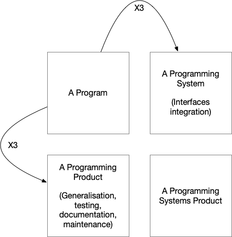

# Lecture 8: Software Quality Assurance

## What is Software Quality Assurance

Software Quality Assurance are the processes we put in place to:

- improve the quality of our software,
- find and fix errors,
- enforce standardization (for team, company, certifications, judicial),
- and to avoid manual mistakes being made,
- keep track of things
- document the code and other artifacts of the project.

Software Quality Assurance is a somewhat loosely defined subject, and you might find conflicting definitions elsewhere.

|                                         |
|:------------------------------------------------------------------------------------------------------------------:|
| *Figure 8.1 - Evolution of the Programming Systems Product based on The Mythical Man Month, Frederick Brooks.* |

Figure 8.1 is a remake of a figure in Frederick Brooks' famous book *The Mythical Man Month*.
The book can be found on the Internet for free - it's definitely worth reading.

*A program* is a piece of software developed without Software Quality Assurance.
We can't say much about it other than *"it works on my machine."*
We can go in two directions to improve the program.

We can turn the program into *a programming product*.
This is a piece of software that is generalized to work on different systems, e.g. handling paths on both Unix-like systems and Windows, no hard-coded configuration, no dependencies on a specific system etc.
The software is also tested, documented, and made ready for long-term maintenance.

The other direction we can go is to make *a programming system*.
This is a piece of software that can integrate with other systems to take part in a larger suite of software systems, usually done by offering a well-defined API, and enabled to integrate with an API of other systems.

Frederick Brooks estimated that the cost (and value) of a piece of software would triple for each of these improvements - and yes, you are looking at a nine times higher cost to deliver *a programming systems product*, that combines all these efforts.

Many of the Software Quality Assurance tools we will discuss in this lecture (if not all) can usually be activated from your favorite IDE as well as from the terminal.

> **Assignment 8.1:** Think of software projects you have done in school or maybe at work. List Software Quality Assurance measures taken in these projects. Do you think they were adequate? Do you think they were worth while? What steps would you take to apply quality assurance?

## Keeping Track Of Things

As projects grow and more people get involved, the need to keep track of things also grow.

You can find lots of tools for project management, and while these tools can be a great help, the most fundamental thing is the *mindset* of the project group.

### Project Planning

As developers, we often want to get started on actually writing code.
However, especially when more people are involved, there is a need to do actual planning up front.

!!! note inline end

    In a *real world scenario*, people are usually hired to do certain roles, and people have different levels of seniority.
    That does not prevent group activities, as this can also be a great learning experience for junior staff members.

First step is to work out a *Requirement Specificaion*, as we have already looked into.

Based on the requirement specification, you can start doing the overall architectural design of the system.
This can be done by designated people, or in smaller project, in coorporation between the whole project group.

Use whiteboards to flesh out overall structures, make changes, discuss details, etc.
This activity can be a great help in creating a shared mindset for the project.

Be careful not to end up with a *design by committee*.
There are things that can not be compromised upon, e.g., you do not want multiple software architectures within a project, etc.
Use the literature and listen to people with actual experience.

You can use *milestones* in Gitlab to keep track of high-level stages in the project.

### Issue Tracking

As your project group work through the project, there will be a need for communication.
Platforms like Gitlab and GitHub includes tool not just for the software repository, but also things like issue tracking.

While it might seem overkill to register and issue, solve the problem, and then close the issue, rather than just solving the problem, it brings clarity and transparency to the project.
In the *real world*, future employers will expect this from you, so you might as well make a habit out of it early in your career.

### Version Numbering

During the project, the source code is always changing.
Making use of version numbering can be a great help in keeping track of things.

Version numbers usually follow a *scheme*, and there are several ways of doing it.

**Semantic versioning** use a scheme of three digits, e.g., `3.5.1`.
In this case, `3` is the *major version*, `5` is the *minor version*, and `1` is the *patch level*.

The idea is as follows:

- major versions may introduce new major features and *breaking changes*
- minor versions may introduce new minor features, but no breaking changes
- patch levels should fix bugs, errors, and security issues

!!! tip inline end

    You can use Git `tags` to keep track of version numbers.

You may also want to operate with a *build version*, that is a simple sequential number that is increased on every single build, whether it is ever published or not.

Very often a project will use both.
The build version is usually automated, while the version number is manually assigned when significant changes has been introduced.

**Unary numbering** is a nerdy versioning scheme famously used in the *Tex* project.
For every version, they add a digit of 𝛑 to the version number.

### Packaging

While you might want to distribute your project as source code, you will most likely also want to distribute a packaged product, even if your project is to be implemented as a service.

Gitlab and GitHub includes tools to automatically package your product.

## Linting

Linting is used to enforce coding standards.

Different languages have different approaches and style guides, some more relaxed than others.
Companies and teams also often have standards, simply because it seems confusing if different developers follow different standards.

Examples of standards and guidelines:

- use of four spaces for indentation
- use of spaces rather than tabs for indentation
- two empty lines before a class
- imports ordered 1) core language, 2) third party, and 3) project modules
- placing open { } on same line as block heading or next line
- no trailing white space (at end of lines or empty lines)

A linting tool can point out or automate coding standards.

> DEMO

> **Assignment 8.2:** Do some research about lint tools for your favorite programming language. Install a lint tool, and try it out with some test code. Work in the terminal environment for now, rather than an integrated development environment.

## Testing

Testing is very important element in software quality assurance.

Several different kinds of tests are introduced below, some of the terms can overlap.

Tests should be easy to run, ideally they should run automatically whenever changes are made.
This often happens as part of a Continuous Integration/Continuous Delivery setup (discussed later in this lecture).

### Unit Testing

A unit test is a test that checks a small piece of code, e.g. a function, method, or class, in isolation.

Unit testing is often done in a "lab like" environment, and does not necessarily represent realistic use of the software.

Unit tests should cover extreme values as well as realistic values, and attention should be paid to whether the tested code produces reasonable results.

### Integration Testing

An integration test checks a larger piece of code, e.g. several classes, working together.

Basically, integration tests check something larger than unit tests, but smaller than system tests.
Like unit tests, integration tests are often done in a "lab like" setting.

### System Testing

System tests should test a whole system under conditions as close to a user scenario as possible (i.e. not "lab like").

### Functional Testing

A functional test checks the software functionality on a user level.

This is different from unit tests in that a functional test might involve several pieces of code throughout the code base, but the functionality is perceived as "one simple function" by the user.

Functional test can be linked to the user and software requirement specifications on a 1:1 basis.

### Subcutaneous Testing

Tests that doesn't run against the end-user interface, i.e. runs against software APIs, are considered subcutaneous tests. Unit tests and system tests are often considered subcutaneous.

### Regression Testing

Regression test are added whenever a bug is fixed.
The regression test should cover the scenarios in which the bug would come in effect.

Regression tests are often overlooked and misunderstood, however, they are important to ensure that we don't reintroduce errors (i.e. regress to a former state), something that is more likely to happen than one would think.

### Testing in a Framework

Working with frameworks bring special challenges for testing.
This is due to the simple fact that you as a developer is not in control of the code flow, and your code will often be passed objects or data that is difficult or cumbersome to recreate in a testing environment.

For this reason many frameworks come with their own testing suite.

### Special Challenges in Web Testing

Web development has yet more challenges as far as testing is concerned.

First, it is generally difficult to test GUI applications, and second, web applications need to run within a browser.

There are ways to run tests within a browser, most notably using [Selenium](https://www.selenium.dev).
We will not discuss Selenium in this course, but you should do some research yourself and have some basic knowledge about this kind of software.

> DEMO

> **Assignment 8.3:** Do some research about testing tools and frameworks in for your favorite programming language (or just some other language than Python). What tools are available?

> **Assignment 8.3:** Write up a few unit tests.

## Documentation

Documentation serves the purpose of letting other developers and users understand the system.
When we refer to *documentaion* we mean documentation written for other developers, as opposed to *user documentaion* that is obviously written for end-users.

Writing good documentation is harder than it seems.

Here are a few guidelines for good documentation:

- be aware of the target group - you can assume other developers knows programming
- don't document what is obvious
- keep it short
- choosing good names for variables, functions, classes, methods etc. also serves as documentation
- often you want to document *why* rather than *what* or *how*
- examples can serve as documentations

*User documentation* should should only be concerned with using the software, including how to get it installed if necessary.
Keep it free from developer lingo, but depending on the software it can be assumed that the user has domain knowledge (i.e. with an accounting system, you can assume the user knows basic accounting).

Make sure documentation is up-to-date.
It might be better to omit certain parts of the documentation if there are not enough resources to keep it up-to-date.

Pay attention to common and established ways of writing documentation for the specific programming language.

> DEMO

> **Assignment 8.4:** What are the standards of documentation in your favorite programming language?

## Self-Study Materials

- [The Lazy Programmer's Guide to Writing Thousands of Tests](https://www.youtube.com/watch?v=IYzDFHx6QPY&list=PLhSvn1XCD2qBqsIv46XU1vcxQ_00Oh9ri&index=2)

## Summary

Software Quality Assurance is about avoiding errors and generally improving the quality of our software products.

Key elements of software quality assurance is:

- adhering to established standards
- uniformity
- testing
- documentation
- automation of multi-step procedures (e.g. building and deploying software)

## Assignments

> **Assignment 8.5:** Write a function in your programming language of choice that takes three single-digit numbers as input and returns the product. Apply all elements of software quality assurance.

